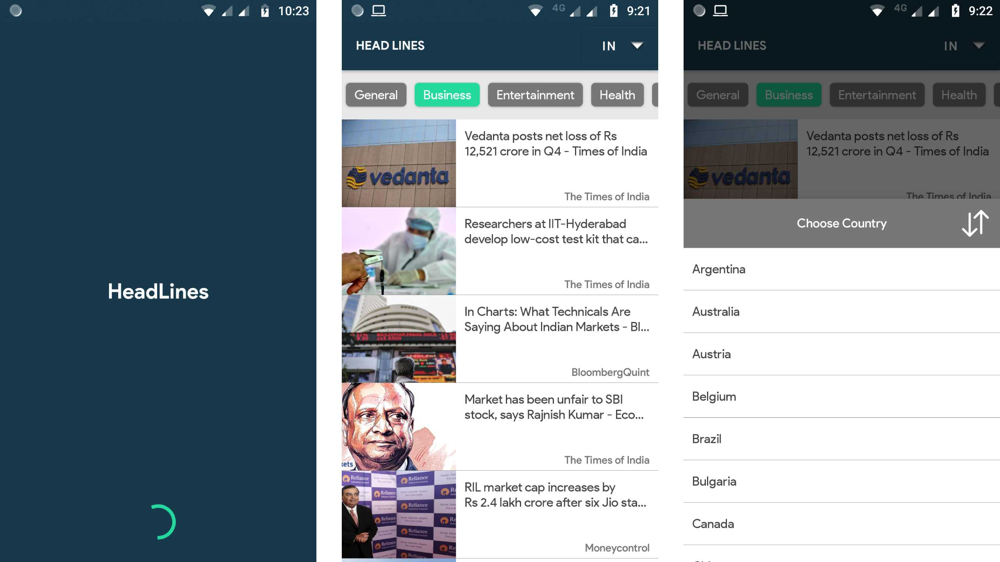

# Head Lines On Your Finger 
Hey! Very excited to build this app using Kotlin Language.

## About
**Head Lines** is an Android mobile app. Its shows the updated(Hot) headlines on your finger. It shows you the headline news in <b>24</b> countries around the world with seven different categories like,
 - *"General",   "Business",   "Entertainment",   "Health",   "Science",
   "Sports",   "Technology"*

## Android Features
This is built using the following android features
 
 - MVVM Architecture
 - Live Data
 - Data Binding
 - View Model

## #30DaysOfKotlinChallenge 
This app is developed during the #30DaysOfKotlinChallenge with following Kotlin Features enabled

 - Null Safety
 - Companion Object
 - Data Class
 - Sealed Class
 - Mutable List with Sorting enabled 
 - Simple Coroutines 

## News Api

Am used the News API [https://newsapi.org/](https://newsapi.org/)

## App Screen

